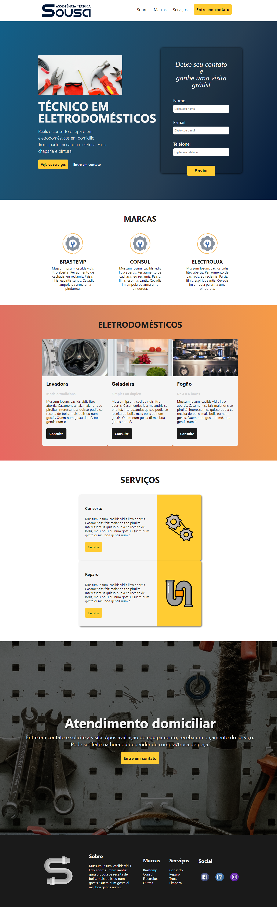

<h1 align="center">
    
</h1>

  :white_check_mark: <a href="https://andreadcsousa.github.io/hiring-coders_desafio/" target="_blank">Veja a página</a>&nbsp;&nbsp;&nbsp;|&nbsp;&nbsp;&nbsp;
  :white_check_mark: <a href="https://www.hiringcoders.com.br/" target="_blank">Conheça a Hiring Coders</a>

# :computer: Projeto
 
- Idealizador: Hiring Coders
- Projeto: Landing Page
- Lado da força: Front-End
- Tipo: Desafio
- Etapa: 4ª Semana

# :rocket: Tecnologias

Esse projeto foi desenvolvido com:

# :art: Layout

